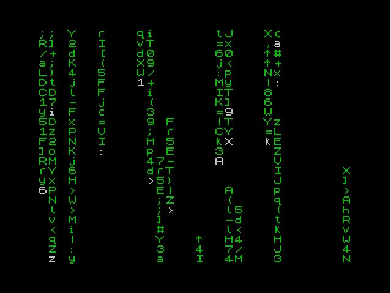

# digirain_zx

Iconic **digital rain** effect from *The Matrix*. Written in *Z80 assembler* for *ZX Spectrum*.

From my experiments and learning Z80 assembler...

### Build requirements
- bas2tap ([bas2tap mirror](https://github.com/speccyorg/bas2tap))
- [pasmo assembler](http://pasmo.speccy.org/)

### Build (Linux)

    $ bas2tap -e -a10 -sdigirain "loader.bas"
    $ pasmo --name "data" --tap "digirain.z80" "digirain_bin.tap"
    $ cat "loader.tap" "digirain_bin.tap" > digirain.tap
    
### Screenshot

